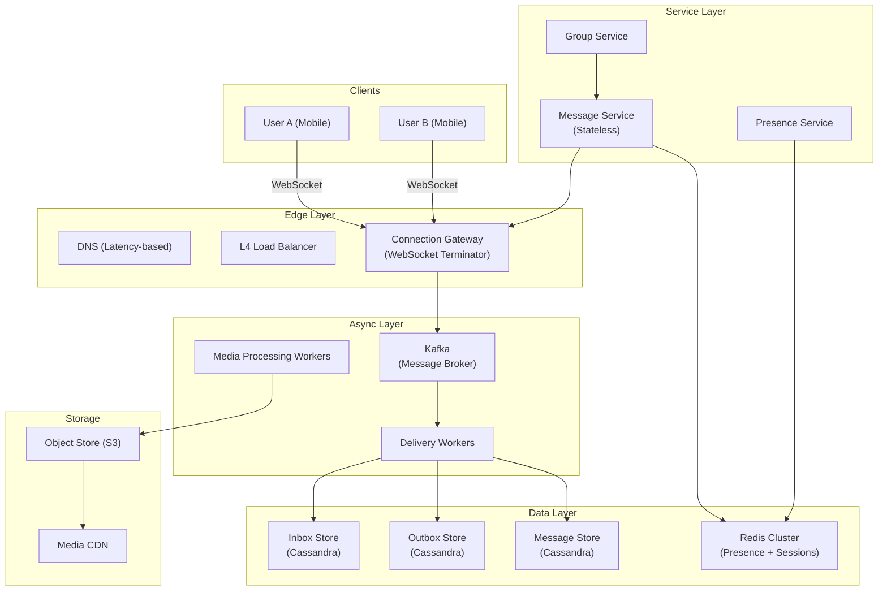

# Sample Solution: WhatsApp-Like Chat System

A worked solution for a real-time messaging system at 2B DAU.

---

## 1. Requirements Clarification

**Functional:**
- 1:1 text messaging, group chats (up to 256 members)
- Media sharing: images, video, audio, documents
- Read receipts, delivery receipts, typing indicators, last-seen
- Push notifications when offline
- End-to-end encryption (E2EE)
- Message history with scroll-back

**Non-functional:**
- p99 delivery latency < 500ms (online)
- p99 message ordering — messages from one sender must arrive in order
- Availability: 99.99% (always can send/receive)
- Consistency: causal ordering within a conversation, eventual for cross-device sync
- Durability: messages never lost after accepted by server

**Scale:**
- 2B DAU, 100B messages/day (50 per user/day avg)
- Media messages: ~10B/day (10% of total), avg size 200KB
- Write QPS: 100B / 86,400 ≈ 1.15M writes/sec (peak 3-5x)
- Storage (messages only): 100B × 1KB × 365 × 5 = ~182 PB (5 years)
- Storage (media): 10B × 200KB × 365 × 5 = ~3.6 EB (5 years)
- WebSocket connections: 2B devices × ~30% online concurrently ≈ 600M persistent connections

---

## 2. Architecture



**Key insight:** This system is **write-heavy** (1.15M writes/sec) with strong ordering and durability requirements. The architecture centers on a persistent connection layer and a fan-out message broker.

---

## 3. Connection Gateway (Deep Dive)

**Problem:** 600M concurrent WebSocket connections. Each connection needs a dedicated TCP socket. A single machine handles ~500K-1M connections → need 600-1200 gateway nodes.

```
Connection Gateway Design:
┌──────────────────────┐
│  Connection Gateway  │
│  ┌───────────────┐  │
│  │ WS Session    │  │─── Redis (session map: user_id → gateway_id)
│  │ Manager       │  │
│  ├───────────────┤  │
│  │ Heartbeat     │  │─── Detect dead connections (30s interval)
│  │ Monitor       │  │
│  ├───────────────┤  │
│  │ Message       │  │─── In-memory buffer per connection
│  │ Buffer        │  │
│  └───────────────┘  │
└──────────────────────┘
```

**Session routing:** When User B is connected to Gateway G7 and User A sends a message:
1. A's gateway publishes to Kafka with recipient ID
2. Delivery worker looks up recipient's gateway in Redis: `session:{user_b} → gateway_7`
3. Worker publishes to G7's internal topic
4. G7 writes to B's WebSocket buffer → sent over wire

**Trade-off:**
- Benefit: Gateway is stateless for message routing; session state is in Redis
- Cost: Every message requires a Redis lookup → adds ~1-2ms
- Mitigation: Local cache on gateway (LRU, 10K entries) for hot recipients

---

## 4. Message Ordering (Deep Dive)

**Problem:** Messages from User A to User B must arrive in order. With multiple delivery workers consuming from Kafka, ordering across partitions breaks.

**Solution: Kafka keyed by conversation_id (for 1:1) or a deterministic routing key.**

```
Kafka Topics:
- "raw_messages": partitioned by conversation_id hash
  → All messages in one conversation land on the same partition
  → Single consumer per partition → ordered processing

Delivery worker flow:
1. Consume from partition
2. Write to recipient's inbox (Cassandra row keyed by recipient_id + message_id)
3. Push via gateway (if online) or store for push notification
```

**Vector clocks for cross-device sync:**

```
Vector Clock: {device_A: 5, device_B: 3, device_C: 7}

When device_A sends a message:
  Clock[device_A] += 1
  Attach {device_A: 6, device_B: 3, device_C: 7} to message

On receive, recipient merges: max(their_clock, message_clock) per device
This provides causal ordering without a centralized sequence number.
```

**Trade-off:**
- Benefit: No single point of failure for sequence numbers, causal consistency
- Cost: Clients must carry clock state, merge logic complexity
- Mitigation: WhatsApp-style — simple version counters per device, conflict resolution is rare in 1:1 chat

---

## 5. Group Chat Fan-Out

**Problem:** A group of 256 members. Sending 1 message → 255 deliveries (fan-out).

**Approaches:**

| Approach | Fan-out on Write | Fan-out on Read |
|----------|------------------|-----------------|
| Mechanism | Write message to each member's inbox | Write once, read by querying group timeline |
| Write cost | O(N) per message | O(1) per message |
| Read cost | O(1) per user | O(N) per user query |
| Best for | Small groups, frequent readers | Large groups, infrequent readers |

**Choice: Hybrid — small groups (≤32) use fan-out on write, large groups use fan-out on read**

For our max 256-member groups:
- Write 1 message → 1 write to "group_messages" table
- Each member's timeline query: `SELECT FROM group_messages WHERE group_id = X ORDER BY created_at DESC LIMIT 50 UNION SELECT FROM inbox WHERE user_id = Y`
- Cache the group timeline in Redis for 30 seconds

**Group metadata** stored in Cassandra:
```sql
CREATE TABLE group_members (
    group_id UUID,
    user_id UUID,
    joined_at TIMESTAMP,
    role TEXT,          -- admin, member
    PRIMARY KEY(group_id, user_id)
);
```

---

## 6. Data Model

```sql
-- Message store (Cassandra)
CREATE TABLE messages (
    conversation_id UUID,
    message_id TIMEUUID,     -- sortable by time
    sender_id UUID,
    content BLOB,            -- E2EE ciphertext
    content_type TEXT,       -- text, image, video, document
    media_ref TEXT,          -- pointer to encrypted object in S3
    created_at TIMESTAMP,
    PRIMARY KEY(conversation_id, message_id)
) WITH CLUSTERING ORDER BY (message_id ASC);

-- Inbox (per-user message list)
CREATE TABLE inbox (
    user_id UUID,
    message_id TIMEUUID,
    sender_id UUID,
    conversation_id UUID,
    content_preview TEXT,     -- first 100 chars, still E2EE
    is_read BOOLEAN DEFAULT FALSE,
    PRIMARY KEY(user_id, message_id)
) WITH CLUSTERING ORDER BY (message_id DESC);

-- User devices for push + E2EE keys
CREATE TABLE user_devices (
    user_id UUID,
    device_id UUID,
    public_key BLOB,
    push_token TEXT,
    last_seen TIMESTAMP,
    PRIMARY KEY(user_id, device_id)
);
```

---

## 7. Trade-offs

### Inbox vs Fan-out on Read (for 1:1)

| | Inbox (Fan-out on Write) | Fan-out on Read |
|---|---|---|
| Benefit | O(1) read — just query your inbox | O(1) write — one DB write per message |
| Cost | N writes per group message (N members) | Read requires JOIN/timeline query |
| Mitigation | Only for 1:1 and small groups; Cassandra handles high write throughput | Timeline cache in Redis |

**Choice:** Inbox model for 1:1 (most common), hybrid for groups.

### Push vs Pull

| | Push (WebSocket) | Pull (Polling) |
|---|---|---|
| Benefit | Real-time (<100ms), low overhead per message | Simpler, no persistent connection, works through firewalls |
| Cost | Expensive: 600M connections, heartbeats, reconnection logic | High latency (min 5s poll interval), wasted bandwidth on empty polls |
| Mitigation | Connection gateway offload, tiered (push for active, notification for inactive) | Long polling as fallback when WebSocket fails |

**Choice:** WebSocket push with HTTP long-polling fallback and push notifications for offline users.

### E2EE vs At-Rest Encryption

| | E2EE | At-Rest Only |
|---|---|---|
| Benefit | Server never sees plaintext. Maximum privacy. | Enables server-side features: search, spam detection, ML |
| Cost | No server-side search, no ML training on content, key management complexity | Users must trust the server |
| Mitigation | Client-side search (indexed locally), federated key management (Signal protocol) | Transparent encryption at rest (AES-256 with KMS) |

**Choice:** E2EE with Signal Protocol (X3DH + Double Ratchet). At-rest encryption as a second layer for stored ciphertext.

---

## 8. Follow-Up Answers

### E2EE Key Distribution

"Signal Protocol uses three key bundles per device: identity key (IK), signed pre-key (SPK), and a pool of one-time pre-keys (OPKs). When Alice messages Bob for the first time, her client fetches Bob's key bundle from our server (we never see the private keys). They perform X3DH to establish a shared secret, then use the Double Ratchet algorithm for forward secrecy. We store only public keys."

### Offline Messages

"When User B is offline, messages are stored in their inbox in Cassandra. When B reconnects via WebSocket, the gateway triggers a sync: `SELECT * FROM inbox WHERE user_id = B AND message_id > last_seen_message_id`. Messages are pushed in chronological order. For push notifications, a separate worker sends APNS/FCM payloads (encrypted, with notification metadata only)."

### Read Receipts

"Read receipts are sent as a special message type. When B reads A's message, B's client sends a message with type=read_receipt referencing the original message ID. This is written to the conversation as a system event. A's client picks it up via a background sync. We batch read receipts (send every 5 seconds or every 10 receipts, whichever comes first) to avoid flooding."
