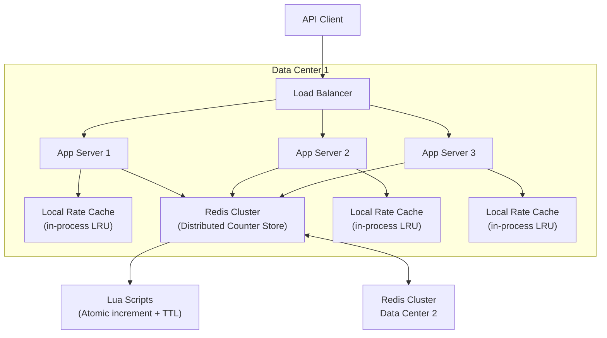

# Sample Solution: Distributed Rate Limiter

A worked solution for a rate-limiting system serving 10M API calls/min across multiple data centers.

---

## 1. Requirements Clarification

**Functional:**
- Per-user (API key) rate limiting: N requests per time window
- Per-endpoint rate limiting: global endpoint throttle
- Burst absorption: allow up to 2x configured rate for short bursts
- Configurable windows: per-second, per-minute, per-hour limits

**Non-functional:**
- Added latency per check < 5ms p99
- Availability: 99.999% (five 9s — rate limiter must never be a bottleneck)
- Accuracy: within 5% of configured rate under normal conditions
- Consistency: eventual — a few extra requests during propagation are acceptable

**Scale:**
- 10M API calls/min peak (166K QPS peak, ~80K avg)
- 100K unique API keys
- 5 data centers, each with 3+ app server clusters
- Rate limiter consulted on every API call

**Key insight:** This is a **latency-critical** system. The rate limiter must add virtually no overhead to the request path.

---

## 2. Algorithm Selection

### Token Bucket

```
Bucket capacity = burst limit (e.g., 200 tokens)
Refill rate = sustained limit (e.g., 100 tokens/sec)

Request flow:
1. Take 1 token from bucket
2. If bucket empty → reject (429 Too Many Requests)
3. Else → allow + continue
```

**Pros:** Simple, allows bursts naturally, memory-efficient.
**Cons:** Two tokens at bucket boundaries may arrive milliseconds apart and both be allowed.

### Sliding Window Log

```
Maintain sorted list of timestamps per key:
[1700000001, 1700000002, 1700000005, ...]

On request:
1. Remove timestamps older than window (e.g., 60s)
2. Count remaining ≤ limit?
3. If yes: add current timestamp, allow
4. If no: reject
```

**Pros:** Perfect accuracy — exactly N requests per sliding window.
**Cons:** O(N) memory per key (store every request timestamp in the window).

### Sliding Window Counter (Chosen)

```
Two counters per key + window:
- current_window: count for the current minute (e.g., 10:03:00-10:03:59)
- previous_window: count for the previous minute (e.g., 10:02:00-10:02:59)

Estimate = previous_window × (1 - overlap_ratio) + current_window
where overlap_ratio = (current_time - start_of_current_window) / window_size
```

**Pros:** O(1) memory per key (2 counters), O(1) per check, smooth sliding behavior.
**Cons:** Approximate count (not exact), but within 3-5% error — acceptable per requirements.

---

## 3. Architecture



**Two-layer architecture:**

| Layer | Technology | Purpose |
|-------|-----------|---------|
| **L1** | In-process LRU cache (local) | Absorb 90%+ of checks for hot keys, < 1µs per check |
| **L2** | Redis Cluster (3 master + 3 replica) | Authoritative counter store, Lua scripts for atomicity |

**Flow per request:**
1. Check L1 cache (hot keys with known quota consumed)
2. If L1 miss or quota nearly exhausted → check L2 (Redis)
3. L2 runs Lua script: increment counter atomically, set TTL, return decision
4. Update L1 cache with result (100ms TTL for L1 entries)

---

## 4. Redis Lua Scripts

### Token Bucket Lua Script

```lua
-- KEYS[1] = rate_limiter:{key}:bucket
-- ARGV[1] = current timestamp (ms)
-- ARGV[2] = refill rate (tokens/sec)
-- ARGV[3] = bucket capacity (burst limit)

local bucket = redis.call("HMGET", KEYS[1], "tokens", "last_refill")
local tokens = tonumber(bucket[1])
local last_refill = tonumber(bucket[2])

if tokens == nil then
    tokens = tonumber(ARGV[3])  -- start full
    last_refill = tonumber(ARGV[1])
end

local elapsed = (tonumber(ARGV[1]) - last_refill) / 1000
local refill = elapsed * tonumber(ARGV[2])
tokens = math.min(tokens + refill, tonumber(ARGV[3]))

local allowed = 0
if tokens >= 1 then
    tokens = tokens - 1
    allowed = 1
end

redis.call("HMSET", KEYS[1], "tokens", tokens, "last_refill", ARGV[1])
redis.call("EXPIRE", KEYS[1], 3600)  -- auto-cleanup

return allowed
```

### Sliding Window Counter Lua Script

```lua
-- KEYS[1] = rate_limiter:{key}:window (hash)
-- ARGV[1] = current timestamp (s)
-- ARGV[2] = window size (s)
-- ARGV[3] = limit
-- ARGV[4] = current_window_key
-- ARGV[5] = previous_window_key

local curr_key = KEYS[1] .. ":" .. ARGV[4]
local prev_key = KEYS[1] .. ":" .. ARGV[5]

local curr_count = tonumber(redis.call("GET", curr_key) or "0")
local prev_count = tonumber(redis.call("GET", prev_key) or "0")

local window_pos = (tonumber(ARGV[1]) % tonumber(ARGV[2])) / tonumber(ARGV[2])
local estimated = prev_count * (1 - window_pos) + curr_count

if estimated >= tonumber(ARGV[3]) then
    return 0  -- reject
end

redis.call("INCR", curr_key)
redis.call("EXPIRE", curr_key, tonumber(ARGV[2]) * 2)

return 1  -- allow
```

---

## 5. Data Model

```redis
-- Rate limit rules (config, loaded at startup)
rate_limiter:rules:user:{api_key}            → {"limit": 1000, "window": 60, "burst": 2000}
rate_limiter:rules:endpoint:POST:/api/create  → {"limit": 100, "window": 60, "burst": 200}

-- Token bucket state per key
rate_limiter:bucket:user:{api_key}:minute     → {tokens: 45, last_refill: 1700000100000}
rate_limiter:bucket:endpoint:{endpoint_hash}  → {tokens: 12, last_refill: 1700000100000}

-- Or sliding window counters:
rate_limiter:window:user:{api_key}:1700000100 → 87  (TTL: 120s)
rate_limiter:window:user:{api_key}:1700000101 → 92  (TTL: 120s)
```

---

## 6. Deep Dives

### 6a. Atomic Increment + TTL

"Redis INCR + EXPIRE is not atomic — between INCR and EXPIRE, the key could be evicted, and a new key would be created without a TTL (permanent memory leak)."

**Solution:** Use Lua scripts (EVAL/EVALSHA) which execute atomically on a single Redis node. TTL is set in the same script that increments the counter. Lua serializes all operations on that key.

### 6b. Clock Skew

**Problem:** Our sliding window algorithm uses local timestamps. If the Redis node and app server clocks drift, window boundaries shift, causing uneven rate enforcement.

**Mitigations:**
1. **Redis TIME command:** Use Redis's server time (atomic, consistent across cluster) instead of app server clock
2. **Acceptable skew:** All servers run NTP. Skew < 50ms. Our window is 60s → 50ms drift is 0.08% error — negligible
3. **Option:** For higher precision, pass a server-assigned timestamp from the LB (H1 timestamp header)

### 6c. Head-of-Line Blocking

**Problem:** The rate limiter is in the request path. If Redis is slow (e.g., BGSAVE), every request blocks.

**Solution:**
1. **L1 cache:** 90%+ of requests never touch Redis. Use an LRU cache with 100ms TTL. Hot keys stay cached.
2. **Circuit breaker:** If Redis p99 latency exceeds 10ms, trip the breaker. Fall back to local rate limiting (approximate, less accurate) for 30 seconds.
3. **Async check (optional):** Non-critical rate limits can be checked asynchronously — allow the request, then post-check and revoke if over limit (penalty box pattern).

---

## 7. Trade-offs

### Accuracy vs Memory vs Speed

| Algorithm | Accuracy | Memory per Key | Speed |
|-----------|----------|---------------|-------|
| Sliding Window Log | Exact | O(N) timestamps | O(N) cleanup |
| Sliding Window Counter | Approx (95%) | O(1) counters | O(1) |
| Token Bucket | Near-exact (burst) | O(1) state | O(1) |
| Fixed Window | Poor (boundary spikes) | O(1) | O(1) |

**Choice:** Sliding Window Counter for general use (good balance), Token Bucket for APIs that need burst control (e.g., login endpoints). Fixed window only for non-critical batch jobs.

### Centralized vs Distributed

| | Centralized (Redis) | Distributed (Local Only) |
|---|---|---|
| Benefit | Exact global count, single source of truth | No network hop, < 1ms |
| Cost | ~3ms per check (network + Redis), Redis is SPOF | Inaccurate (each node counts independently) |
| Mitigation | Redis Cluster + replicas + circuit breaker | Sync counters every 10s, accept inaccuracy |

**Choice:** Hybrid Local + Redis. L1 cache handles most checks, L2 Redis provides authoritative count. This gives both speed and accuracy.

---

## 8. Follow-Up Answers

### Burst Absorption

"Token bucket naturally absorbs bursts up to the bucket capacity. For example, if the limit is 100 req/min with burst of 200, a client that was idle for 2 minutes can send 200 requests immediately. After that, they're limited to the refill rate (100/min). This handles legitimate traffic spikes (e.g., after a deploy) while blocking sustained abuse."

### Multi-DC Synchronization

"Each data center has its own Redis cluster. Cross-DC replication (Redis Replication or CRDT-based) runs asynchronously with ~100ms lag. Rate counters are eventually consistent. During normal operation, each DC enforces its share of the rate (1/N of total, where N = number of DCs). If a DC fails, traffic shifts to remaining DCs, which dynamically adjust their local share. This means transient double-counting during failover (accepting up to 2x rate for 30 seconds) — acceptable per requirements."

### Abuse Blocking (Beyond Rate Limiting)

"Rate limiting is layer 1. We also implement:
1. **IP reputation:** Block known bad IPs at the edge (CDN/LB). Maintain a Redis set of blocked IPs with TTL.
2. **Behavioral analysis:** If a key suddenly drops from 10 req/min to 10K req/min → auto-block + alert. This catches compromised API keys.
3. **Distributed sliding bloom filter:** Track unique nonces/tokens to detect replay attacks across DCs."
