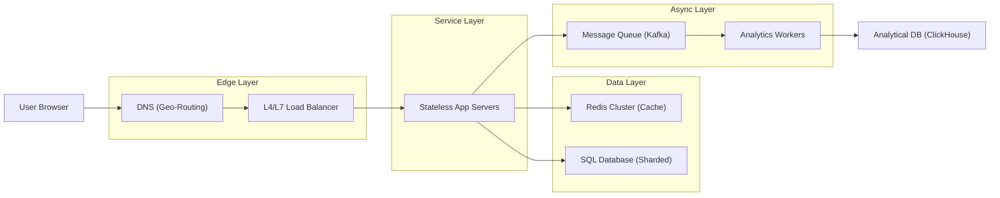

# Sample Solution: URL Shortener

A worked solution at the expected quality bar for a system design interview.

---

## 1. Requirements Clarification (Transcript)

**Candidate:** "I'd like to clarify a few things before we start."

**Functional:**
- Core: create short URL → redirect to long URL
- Edge: custom aliases, expiration TTL, analytics (click counts, referrers)
- Non-core: bulk creation, API access, QR code generation

**Non-functional:**
- Redirect p99 latency < 100ms
- Availability: 99.99% (52 min downtime/year)
- Consistency: eventual is fine for redirects (stale redirect not catastrophic)
- Durability: links should never lose their mapping

**Scale:**
- 100M DAU, 10M new short URLs/day, 1B redirects/day
- Read QPS: 1B / 86,400 ≈ 11,500 QPS (peak ~3x = 35K QPS)
- Write QPS: 10M / 86,400 ≈ 115 QPS (peak ~5x = 600 QPS)
- Storage (5 yr): 10M × 365 × 5 = 18.25B rows × ~500 bytes ≈ 9 TB (with 2x padding = 18 TB)
- Bandwidth: 35K reads × ~1 KB redirect response ≈ 35 MB/s egress ≈ 280 Mbps

**Single-server check:** 18 TB exceeds a single machine. 35K QPS is manageable with a moderate cluster. Distributed architecture needed for storage and availability, not throughput.

---

## 2. Traffic Estimates

| Metric | Value |
|--------|-------|
| Short URLs created per day | 10 million |
| Redirects per day | 1 billion (100 reads per write) |
| Redirects per second (avg) | ~11,500 |
| Redirects per second (peak) | ~35,000 |
| Creates per second (avg) | ~115 |
| Creates per second (peak) | ~600 |
| Storage per year (raw) | ~1.8 TB |
| Storage 5-year (padded) | ~18 TB |

---

## 3. Architecture



**Flow:**
1. **Create:** User POSTs long URL → app generates short ID → writes to DB + cache → returns short URL
2. **Redirect:** User GETs short URL → app checks cache → if miss, checks DB → returns 301 redirect → async analytics event
3. **Analytics:** Async worker consumes click events → aggregates and writes to OLAP store

---

## 4. Data Model

```sql
CREATE TABLE url_mappings (
    short_id VARCHAR(10) PRIMARY KEY,    -- Base62 encoded, e.g., "aB3xK9"
    original_url TEXT NOT NULL,
    created_at TIMESTAMP DEFAULT NOW(),
    expires_at TIMESTAMP NULL,
    custom_alias VARCHAR(100) NULL,
    user_id BIGINT NULL,
    INDEX(expires_at) WHERE expires_at IS NOT NULL,
    INDEX(user_id, created_at)
);

CREATE TABLE click_events (
    id BIGINT AUTO_INCREMENT PRIMARY KEY,
    short_id VARCHAR(10) NOT NULL,
    clicked_at TIMESTAMP DEFAULT NOW(),
    referrer TEXT,
    user_agent TEXT,
    ip_address VARCHAR(45),
    country_code CHAR(2),
    INDEX(short_id, clicked_at)
);

-- Analytics materialized daily
CREATE TABLE daily_analytics (
    short_id VARCHAR(10) NOT NULL,
    date DATE NOT NULL,
    click_count BIGINT DEFAULT 0,
    unique_visitors BIGINT DEFAULT 0,
    PRIMARY KEY(short_id, date)
);
```

---

## 5. Deep Dives

### 5a. ID Generation

**Requirements:** Globally unique, short (6-10 chars), URL-safe, sortable by creation time (optional), high throughput.

**Choice: Snowflake-style ID → Base62 encode**

```
Snowflake 64-bit layout:
| 1 bit (unused) | 41 bits (timestamp ms) | 10 bits (worker ID) | 12 bits (sequence) |
```

- Timestamp gives ~69 years of unique IDs
- Worker ID (datacenter + machine) prevents collision
- Sequence gives 4096 IDs/ms per worker = 4M IDs/sec — well above our 600 peak writes/sec

**Base62 encoding** of the 64-bit ID produces 10-11 characters (`[0-9a-zA-Z]`). For shorter URLs, use the lower 36 bits → ~6 chars.

**Trade-off:**
- Benefit: No coordination needed (each worker generates locally), sortable by time
- Cost: IDs are 64-bit → base62 output is 10 chars, not 6
- Mitigation: Use a smaller bit range (36 bits) for sub-7 char URLs, accept collision risk with collision detection on insert

### 5b. Redirect Flow (Detailed)

```
1. User requests GET /aB3xK9
2. App extracts "aB3xK9" from path
3. App checks Redis: GET url:aB3xK9
   - HIT → return original_url immediately → HTTP 301 redirect
   - MISS → Query DB: SELECT original_url, expires_at FROM url_mappings WHERE short_id = ?
       - Not found → 404
       - Expired → 410 Gone
       - Found → write to Redis (SETEX url:aB3xK9 <original_url> TTL=3600) → 301 redirect
4. Fire-and-forget: push click event to Kafka topic "click_events"
5. Return HTTP 301 (permanent redirect, browser caches it) or 302 (temporary, for analytics per redirect)
```

**Cache strategy: Cache-Aside (Lazy Loading)**
- TTL: 1 hour for popular URLs, but refresh on each hit (sliding expiration)
- Lease mechanism: On cache miss, first thread acquires a lease (SETNX url:aB3xK9:lease → 10s TTL) → only that thread hits DB → others wait/retry
- Prevents thundering herd on popular short URLs

**301 vs 302:**
- 301 (Moved Permanently): Browsers cache the redirect, less load on our servers
- 302 (Found): Every request hits our servers, enables per-click analytics
- Recommended: 302 for trackable links, 301 for known-permanent custom aliases

### 5c. Cache Strategy

| Aspect | Decision |
|--------|----------|
| Pattern | Cache-Aside (Lazy Loading) |
| Technology | Redis Cluster (6 nodes, 3 replicas) |
| Key format | `url:{short_id}` → `original_url` |
| TTL | 1 hour, sliding (reset on read) |
| Eviction | LRU |
| Stampede protection | Leases (SETNX with 10s TTL) |
| Failure mode | Gutter pool (1 spare node) absorbs traffic |

---

## 6. Trade-offs

### Sequential vs Random IDs

| | Sequential IDs | Random IDs (Snowflake) |
|---|---|---|
| Benefit | Short URLs, easy to guess? | Can't enumerate all URLs, collision-free |
| Cost | Guessable, hot DB write page (last page on auto-inc) | Slightly longer (10 vs 6 chars) |
| Mitigation | — | Truncate to 36-bit for shorter URLs |

**Choice:** Snowflake-style random IDs. Security (non-guessability) outweighs 3 extra characters.

### Single DC vs Multi-DC

| | Single DC | Multi-DC |
|---|---|---|
| Benefit | Simpler, no replication lag | Higher availability, lower latency globally |
| Cost | Higher latency for far users, single point of failure | Complex: cross-DC replication, conflict resolution |
| Mitigation | CDN for redirect responses | Active-Active with leaderless per-ID shard ownership |

**Choice:** Start single-DC, add multi-DC when global latency becomes a problem. For redirects, eventual consistency between DCs is acceptable.

### Sync vs Async Analytics

| | Sync Analytics | Async Analytics |
|---|---|---|
| Benefit | Accurate, real-time counts | Doesn't block the redirect |
| Cost | Adds 50-200ms to redirect latency | Counts may be slightly delayed |
| Mitigation | — | Kafka with at-least-once delivery, dedup on read |

**Choice:** Async via Kafka. Redirect path must stay under 100ms.

---

## 7. Follow-Up Answers

### Custom Aliases

"Users can request custom aliases (e.g., `/my-link`). We validate uniqueness at write time with a UNIQUE constraint on `custom_alias`. The short_id field still uses our generated ID — custom aliases are stored in a separate index. For the custom alias to redirect, we maintain a bloom filter in Redis to quickly reject non-existent aliases and a reverse cache (`alias:{custom}` → `original_url`)."

### Expiration

"Each URL has an `expires_at` timestamp. A background sweeper runs hourly, deleting expired rows and cache keys. For compliance, we keep a tombstone record for 30 days after expiration. On redirect attempt of an expired URL, we return HTTP 410 Gone with a message. We also offer a grace period (7 days after expiration) where we return 410 but the owner can reactivate."

### Abuse Blocking

"Three layers:

1. **Rate limiting at edge:** Per-IP and per-user quotas on create endpoint (e.g., 100 URLs/min per IP). Token bucket per API key.
2. **URL validation:** Check against blocklisted domains (phishing, malware) at create time using a real-time threat feed. Hash-based dedup to catch the same malicious URL.
3. **Post-hoc detection:** Analytics pipeline scans click velocity. If a short URL suddenly spikes to 10K clicks/min from suspicious IPs, auto-disable and alert. This catches abuse that passes initial validation."
